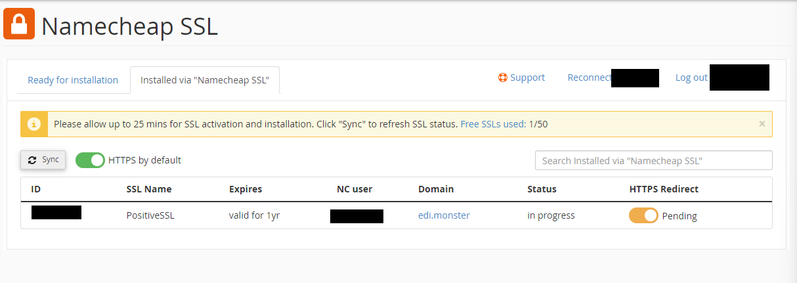

# Personal project

### SSL esta pendiente de instalar, puede tomar hasta 24 horas en propagarse

https://www.edi.monster/

o temporalmente:

http://www.edi.monster/

#### Por que edi monster? 
Me salio en 1 dolar el dominio + 2 dolares de hospedaje con un cupon que tenia :D

## Blog Personal

https://alexantartico.github.io/ch-project/

1. Sinceramente no sabia de que que hacer la pagina web. Comenze con la idea de una pagina que hablara de finanzaz ya que trabajo para una institucion financiera. Despues lo cambie a un blog personal y finalmente, mi objetivo es que no solo sea un blog personal sino un tipo de blog en espanol donde quien sea pueda publicar cualquier cosa referente principalmente a tecnologia. Falta mucho para eso pero probablemente lo hare.

2. Mi conocimiento actual se queda corto, pero poniendo unas cosas aqui y otras alla puede ser algo que quede listo en los proximos meses. Por ej, conozco algo de db's y podria generar una pero no conozco de logins y autenticaciones, en retrospectiva; soy muy afortunado en trabajar en un lugar donde usamos kerberos y AFS. Si no concen estas tecnologias, les invito a investigar un poco de ellas. Si un dia trabajan en un mounstro de empresa o crean una (llamenme, siempre me gustan los retos!) les van a servir mucho. Tambien existe la posibilidad de que sea algo que no se concrete nunca.

3. El codigo esta sobre comentado en la mayoria de los branches. Estoy consciente de que es una mala practica, pero a mi me esta ayudando a no perderme, por lo menos en lo que puedo distinguir cual es un item y cual un container. Main branch deberia contener los comentarios minimos.

4. Muchos comentarios estan en ingles, mucho de mi conocimiento en IT esta en ingles, sin embargo esta clase es util para conocer mucha terminologia en espanol, por ejemplo no conocia la pabra Grilla. Espero no sea molesto, es lo que hay por el momento :V

5. El dominio de la pagina es comprado en namecheap. Por 1.75 USD y un domino .monster (sounds really cool) la vd no lo pude resistir. 4 USD por hosting, es caro por el momento teniendo en cuenta que mi conocimiento en front end es subpar por el momento, pero siempre es divertido hacer un desmadre con VMs y cloud servers. Espero que por lo menos me ayude a conseguir ofertas de empleo o trabajos como consultoria.

6. No tengo idea de disenio o de UX, dependeo de quien visite este proyecto. All feedback welcome, I'll be in your care.

7. Me gusta el nombre de Alejandro, pero ire x Edu, Edy, Edi, Eddie o Eduardo, es menos comun y pude diferenciarme.

Cheers.
Edi.